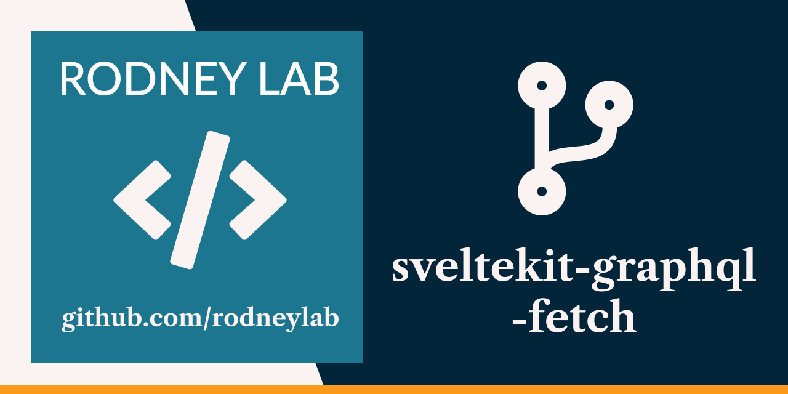

<p align="center">
  <a aria-label="Open Rodney Lab site" href="https://rodneylab.com" rel="nofollow noopener noreferrer">
    
  </a>
</p>
<h1 align="center">
  SvelteKit GraphQL Fetch
</h1>

# sveltekit-graphql-fetch

[](https://stackblitz.com/github/rodneylab/sveltekit-graphql-fetch)

SvelteKit demo code for making GraphQL queries with just fetch and no need for urql or Apollo client. The code accompanies the <a aria-label="Open Rodney Lab blog post on Svelte Kit Graph Q L queries with fetch only" href="https://rodneylab.com/sveltekit-graphql-queries-fetch/">article on SvelteKit GraphQL queries with fetch only</a>. If you have any questions, please drop a comment at the bottom of that page.

## Building and previewing the site

If you're seeing this, you've probably already done this step. Congrats!

```bash
git clone https://github.com/rodneylab/sveltekit-graphql-fetch.git
cd sveltekit-graphql-fetch
pnpm install # or npm install
pnpm run dev
```

## Building

```bash
pnpm run build
```

> You can preview the built app with `pnpm run preview`, regardless of whether you installed an adapter. This should _not_ be used to serve your app in production.

This app uses the **Cloudflare adapter** so to build in Pages remember to set the build output directory to `.svelte-kit/cloudflare` in the Pages console.

Feel free to jump into the [Rodney Lab matrix chat room](https://matrix.to/#/%23rodney:matrix.org).
